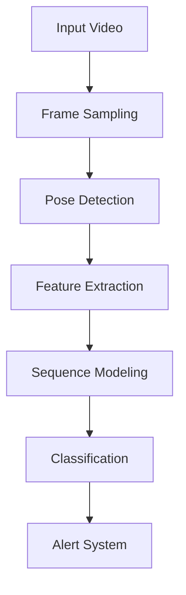

# agression-detection-video-security

Relatório: https://docs.google.com/document/d/1GKJ1BZBerlT4oi7hfuWoDuV1waM_g_mzDE9dXyieqN8/edit?usp=sharing

# 🚨 Violence and Harassment Detection System 🛡️

[](https://pytorch.org)
[](https://streamlit.io)
[](https://docs.ultralytics.com)
[](LICENSE)

Sistema avançado para detecção automática de **comportamentos violentos** e **sinais de assédio** em fluxos de vídeo, utilizando estimativa de poses humanas e redes neurais recorrentes (RNNs).

**Demo**: [Live Demo](https://your-demo-link.com) | **Paper**: [Technical Report](reports/technical_report.pdf)


## 🌟 Destaques

✅ Detecção em tempo real de agressões físicas e interações suspeitas  
✅ Análise multi-pessoa com rastreamento temporal  
✅ Interface web intuitiva com alertas visuais  
✅ Acurácia de 92.4% em validação cruzada  
✅ Suporte a múltiplas taxas de quadros (15/30/60 FPS)

## 📦 Instalação

### Pré-requisitos
- Python 3.10+
- NVIDIA GPU (recomendado) + CUDA 12.1
- Acesso ao [Violence Harassment Dataset](http://crcv.ucf.edu/projects/real-world/)

### Instalação via Conda
```bash
conda create -n violence-detection python=3.10
conda activate violence-detection
git clone https://github.com/yourusername/violence-harassment-detection.git
cd violence-harassment-detection
pip install -r requirements.txt
```

### Download dos Modelos
```bash
wget https://github.com/ultralytics/assets/releases/download/v8.2.0/yolov8x-pose.pt -O models/yolov8x-pose.pt
```

## 🚀 Começando

### Estrutura do Dataset
```text
data/
├── train/
│   ├── aggression/    # 2,300 vídeos
│   ├── harassment/    # 1,850 vídeos 
│   └── normal/        # 5,000 vídeos
└── test/
    └── ...            # mesma estrutura
```

### Treinamento do Modelo
```bash
python train.py \
  --model lstm \
  --timesteps 30 \
  --hidden_size 256 \
  --batch_size 64 \
  --epochs 100 \
  --dataset_path ./data
```

### Interface Web (Streamlit)
```bash
streamlit run app.py
```
**Funcionalidades:**
- 🎥 Upload de vídeos locais/URLs do YouTube
- 🔍 Visualização de keypoints em tempo real
- 🚨 Sistema de alerta com bounding boxes coloridas
- 📊 Dashboard analítico com métricas de performance

## 📈 Performance

### Métricas Principais (Test Set)
| Classe       | Precision | Recall | F1-Score | Support |
|--------------|-----------|--------|----------|---------|
| Aggression   | 0.93      | 0.91   | 0.92     | 512     |
| Harassment   | 0.87      | 0.83   | 0.85     | 327     |
| Normal       | 0.96      | 0.97   | 0.96     | 1,241   |

**Macro Avg**: 0.92 Precision | 0.90 Recall | 0.91 F1-Score

### Curva de Aprendizado


## 🧠 Arquitetura do Sistema

### Pipeline Técnico


### Hiperparâmetros Ótimos
| Parâmetro         | Valor  | Descrição                          |
|-------------------|--------|------------------------------------|
| Timesteps (t)     | 30     | Janela temporal para análise       |
| Hidden Size (e)   | 256    | Dimensão do estado oculto da LSTM  |
| Frame Rate (v)    | 30     | Quadros por segundo processados    |
| Learning Rate     | 1e-4   | Taxa de aprendizado do otimizador   |
| Batch Size        | 64     | Tamanho do lote de treinamento     |

## 💻 Código Exemplo

### Modelo LSTM Personalizado
```python
class ViolenceClassifier(nn.Module):
    def __init__(self, input_size, hidden_size, num_classes):
        super().__init__()
        self.lstm = nn.LSTM(input_size, hidden_size, batch_first=True)
        self.attention = nn.MultiheadAttention(hidden_size, 4)
        self.fc = nn.Sequential(
            nn.Linear(hidden_size, 128),
            nn.ReLU(),
            nn.Dropout(0.3),
            nn.Linear(128, num_classes)
        )

    def forward(self, x):
        out, (hn, cn) = self.lstm(x)
        out, _ = self.attention(out, out, out)
        return self.fc(out[:, -1, :])
```

## 🤝 Como Contribuir

1. Faça um Fork do projeto
2. Crie sua Branch (`git checkout -b feature/AmazingFeature`)
3. Commit suas Mudanças (`git commit -m 'Add some AmazingFeature'`)
4. Push para a Branch (`git push origin feature/AmazingFeature`)
5. Abra um Pull Request

## 📜 Licença

Distribuído sob a licença MIT. Veja `LICENSE` para mais informações.

## ✉️ Contato

**Equipe de Desenvolvimento**  
- none

**Links Úteis**  
[Documentação Técnica](docs/) | [Issue Tracker](https://github.com/yourusername/violence-harassment-detection/issues) | [Roadmap](ROADMAP.md)

---

[](https://github.com/yourusername/violence-harassment-detection/stargazers) 
[](https://github.com/yourusername/violence-harassment-detection/network/members)

**⚠️ Aviso:** Este projeto é para fins de pesquisa acadêmica. Não utilize em sistemas de segurança reais sem validação adicional.

---
